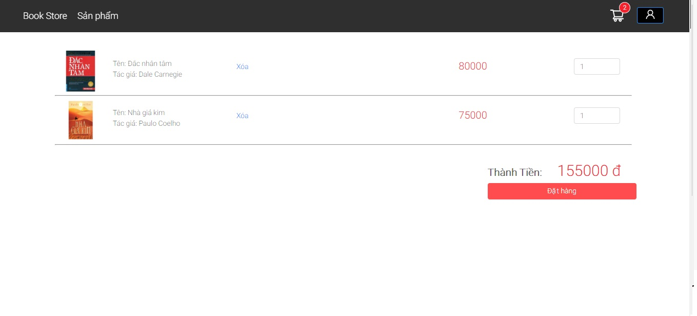

# Bài tập lớn: Mua bán sách

Hệ thống bán sách online cho phép khách hàng chọn những cuốn sách yêu thích của mình với giá cả phải chăng.


## Đặc điểm

-    Mua bán sách online

## Yêu cầu

-   Python 3.6+
-   Django 2.1.7+
-   Node.js 8.0+
-   ReactJs

## Cài đặt

Để cài đặt, việc đầu tiên cần làm là sao chép các kho dữ liệu bằng câu lệnh sau:

```bash
git clone https://github.com/Haphuong-1306/Project2
cd src
```

Để cài đặt  Data Labelling Platform ta thực hiện như sau:


**Setup Python environment**

Đầu tiên chúng ta cần phải cài đặt các phụ thuộc. Chạy các lệnh sau :

```bash
pipenv install
```

Khởi tạo cơ sở dữ liệu :

```bash
python manage.py makemigrations
python manage.py migrate
```

Cài đặt frontend:

```bash
cd frontend
npm install
```


## Cách sử dụng 

### Bắt đầu chạy server

Sau khi setup xong môi trường ta tiếp tục chạy lệnh sau :


#### Chạy máy chủ Django 

Chúng ta cần tạo ra một người sử dụng làm admin cho trang web. Chạy lệnh sau :

```bash
python manage.py createsuperuser
```

Để bắt đầu các máy chủ, chạy lệnh sau:

```bash
python manage.py runserver
```


Để chạy giao diện chúng ta thực hiện câu lệnh:

```bash
cd frontend
npm start
```


Giao diện sẽ được khởi động mặc định ở cổng 3000 với địa chỉ <http://127.0.0.1:3000>. Bạn sẽ thấy màn hình trang chủ


### Quản lý của admin
Khi bạn đã hoàn thành các bước cài đặc ở trên bạn có thể đăng nhập vào trang quản lý của admin để quản lý tài khoản, sách,...
Vào trang <http://localhost:8000/admin/login/>
Đăng nhập với tài khoản 'admin' và 'password' bạn tạo ở trên.


### Đăng ký tài khoản 
Với tư cách là khách hàng chưa có tài khoản ở hệ thống, bạn có thể đăng ký thông tin để có thể mua sách.


### Đăng nhập
Với tư cách là khách hàng đã có tài khoản ở hệ thống, bạn có thể đăng nhập.


###  Giao diện sản phẩm sau khi đăng nhập

Giao diện sản phẩm.


Có thể thêm sách vào giỏ hàng và xem giỏ hàng :



Đặt hàng trong giỏ hàng:


Sau khi điền đủ thông tin và đặt hàng thành công 


### Trang cá nhân
Để xem thông tin cá nhân ấn vào biểu tượng cá nhân góc phải màn hình


Lịch sử mua hàng:


### Trang admin
Giao diện quản lý sách của admin.


### Video demo 


